Seeing What a GAN Cannot Generate
=================================

State-of-the art GANs can create increasingly realistic images, yet
they are not perfect.

What is a GAN *unable* to generate?
This repository contains the code for the ICCV 2019 paper
[Seeing What a GAN Cannot Generate](
http://ganseeing.csail.mit.edu/papers/seeing.pdf), which introduces
a framework that can be used to answer this question.

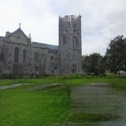 | 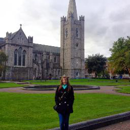
:-----------------:|:-----------------------:
GAN reconstruction |       Real photo 

Our goal is *not* to benchmark *how far* the generated
distribution is from the target.  Instead, we want to
visualize and understand *what* is different between real
and fake images.

## Mode-dropping and the problem of visualizing omissions

Visualizing the omissions of an image generator is an interesting
problem.  We address it in two ways.

   1. We visualize omissions within the *distribution* of images.
   2. We visualize omissions within *individual* images.

## Seeing omissions in the distribution

To understand what the GAN's output distribution is missing, we
gather segmentation statistics over the outputs, and compare the
number of generated pixels in each output object class with the
expected number in the training distribution.

A Progressive GAN trained to generate LSUN outdoor church images
is analyzed below.

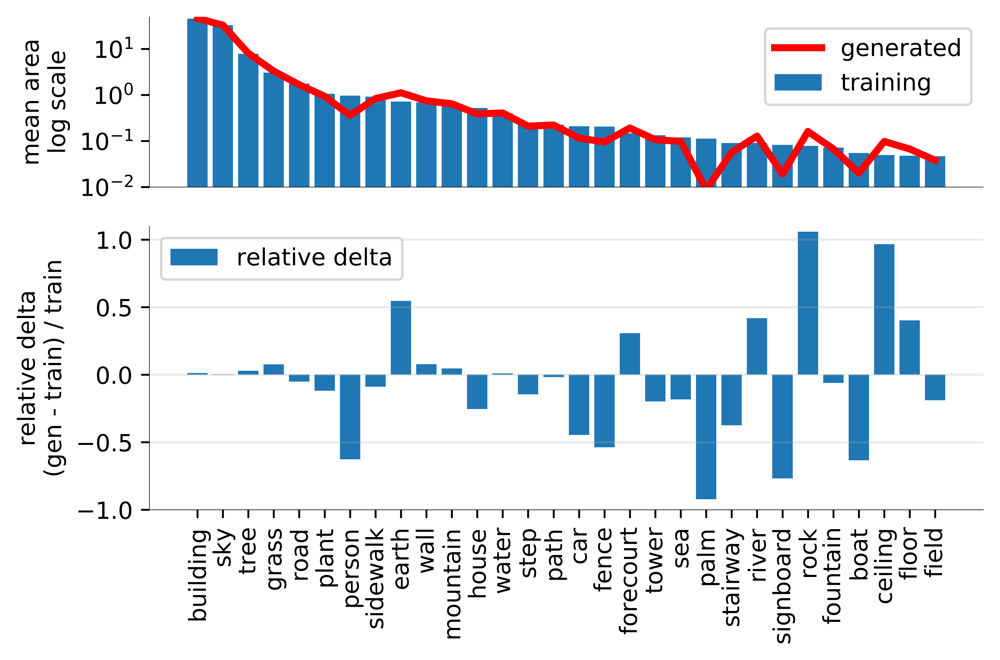

The model does not generate enough pixels of people, cars, palm trees,
or signboards compared to the training distribution.  
The script `run_fsd.sh` and the notebook `histograms.ipynb`
show how we collect and visualize these segmentation statistics.

## Seeing omissions in individual images

To understand what the GAN misses in individual images, we create
pairs of examples, where a real photo is paired with an image
generated using the model learned by the GAN.  This reconstruction
process can perfectly recover images that are generated.  Therefore,
Real photos that cannot be reconstructed reveal specific examples
of what the GAN cannot generate.

These visualizations are created by `run_invert.sh`.

### People

GAN reconstruction              | Real photo 
:------------------------------:|:------------------------------:
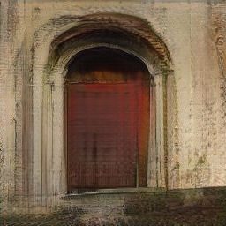 | 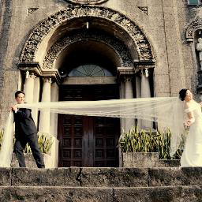
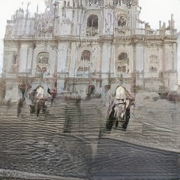 | 
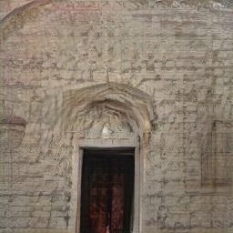 | 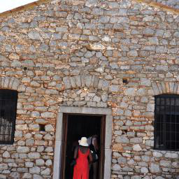
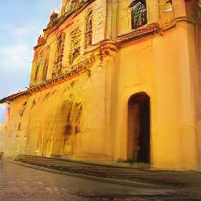 | 

<!---
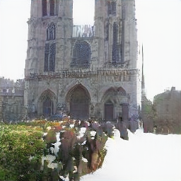 | 
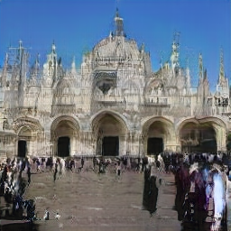 | 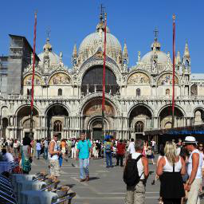
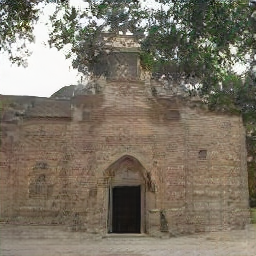 | 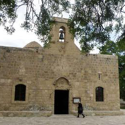
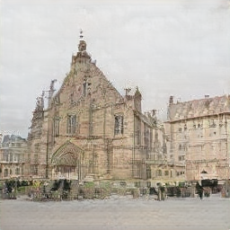 | 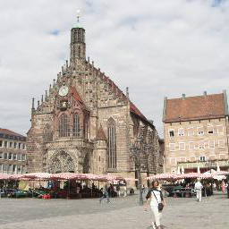
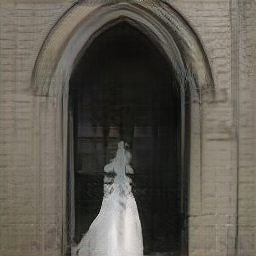 | 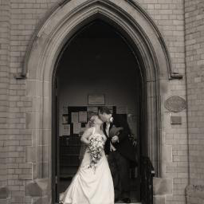
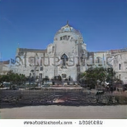 | 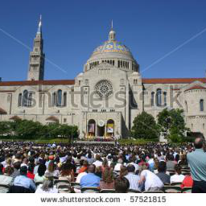
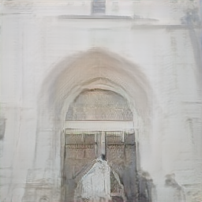 | 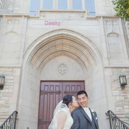
--->

### Vehicles

GAN reconstruction              | Real photo 
:------------------------------:|:------------------------------:
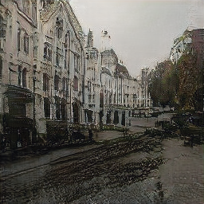  | 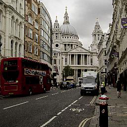
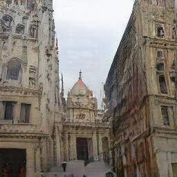 | 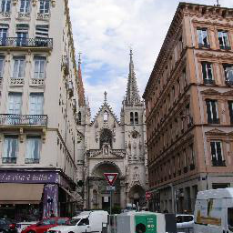
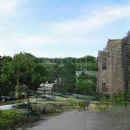 | 

<!---
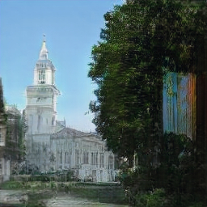 | 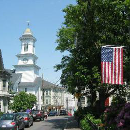
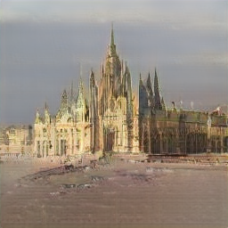 | 
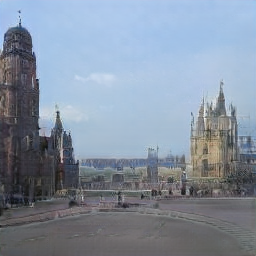  | 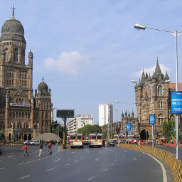
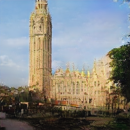  | 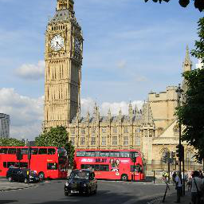
--->

### Signs

GAN reconstruction              | Real photo 
:------------------------------:|:------------------------------:
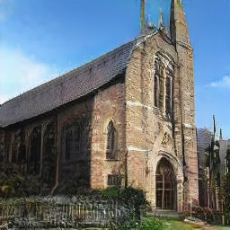  | 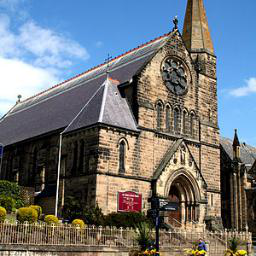
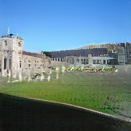 | 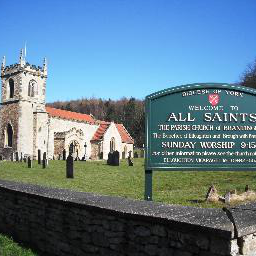
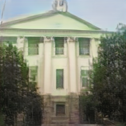  | 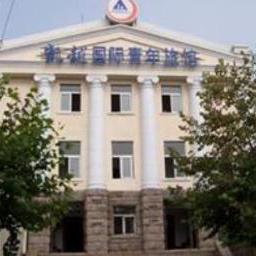

### Monuments

GAN reconstruction              | Real photo 
:------------------------------:|:------------------------------:
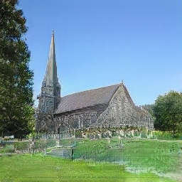  | 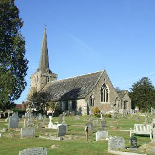
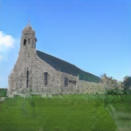 | 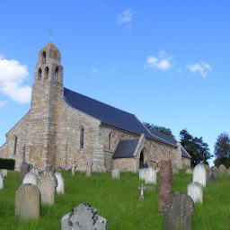
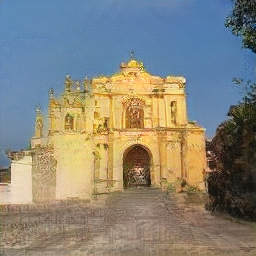 | 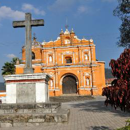
<!---
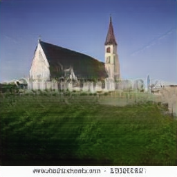 | 
--->

### Palm trees

GAN reconstruction              | Real photo 
:------------------------------:|:------------------------------:
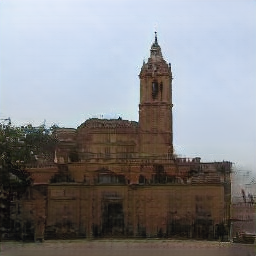 | 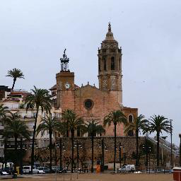

