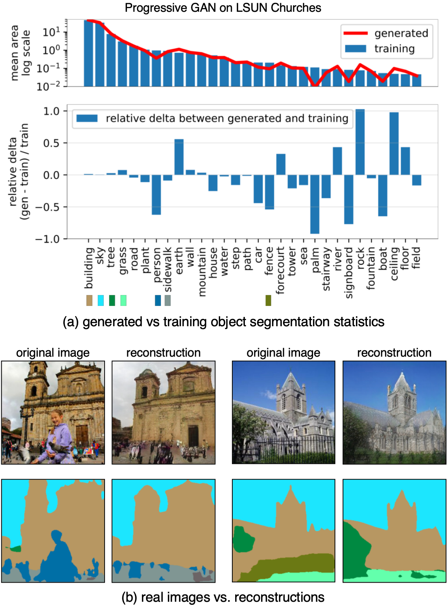

Seeing What a GAN Cannot Generate
=================================

State-of-the art GANs can create increasingly realistic images, yet
they are not perfect.

What is a GAN *unable* to generate?
This repository contains the code for the ICCV 2019 paper
[Seeing What a GAN Cannot Generate](
http://ganseeing.csail.mit.edu/papers/seeing.pdf), which introduces
a framework that can be used to answer this question.

 | 
:-----------------:|:-----------------------:
GAN reconstruction |       Real photo 

Our goal is *not* to benchmark *how far* the generated
distribution is from the target.  Instead, we want to
visualize and understand *what* is different between real
and fake images.

## Mode-dropping and the problem of visualizing omissions

Visualizing the omissions of an image generator is an interesting
problem.  We address it in two ways.

   1. We visualize omissions within the *distribution* of images.
   2. We visualize omissions within *individual* images.

## Seeing omissions in the distribution

To understand what the GAN's output distribution is missing, we
gather segmentation statistics over the outputs, and compare the
number of generated pixels in each output object class with the
expected number in the training distribution.

For example, we can see that a a Progressive GAN church model does
not generate enough pixels of apeople, cars, palm trees, or
signboards compared to the training distribution.

## Seeing omissions in individual images
